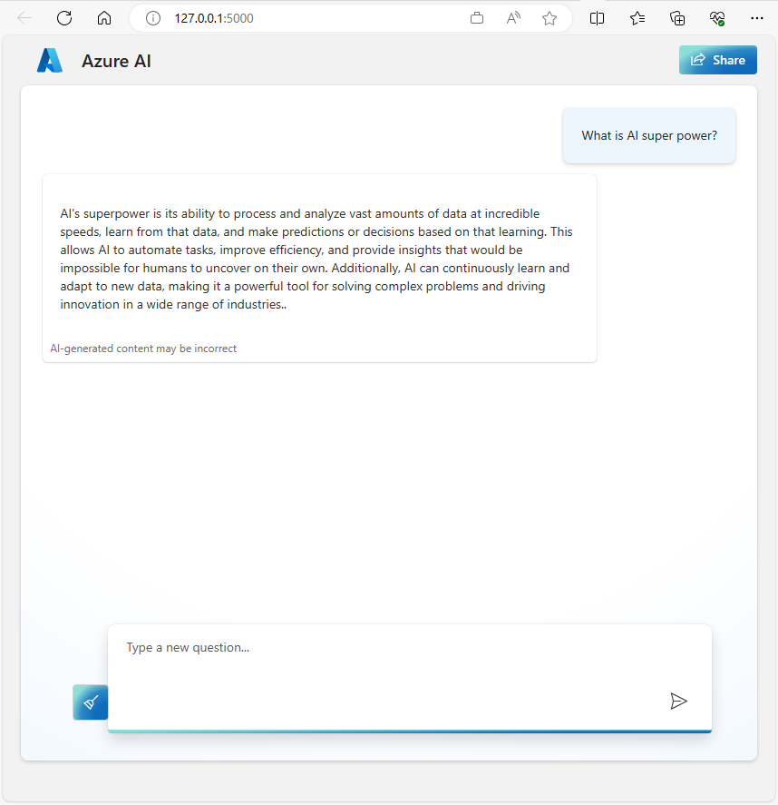
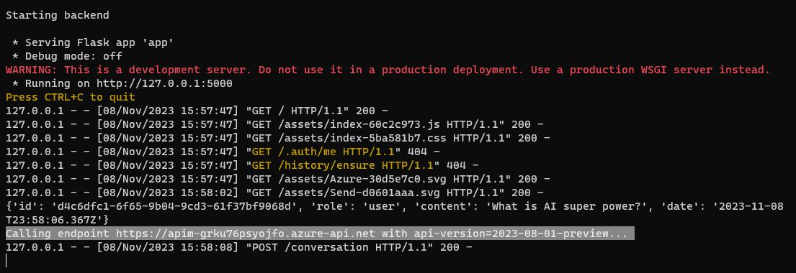

This is sample deployment of Azure API Management that uses a policy to provide API Key, limit tokens and ground the AI assitant. This way the client application and end user only have to provide the user prompt.


To deploy the samples, use `azd up` 

Examples

```powershell
$env:AZURE_OPENAI_KEY="your-key-here"
$env:AZURE_OPENAI_ENDPOINT="https://devdiv-test-playground.openai.azure.com"
$env:AZURE_OPENAI_MODEL="gpt-35"

azd up -e azure-apim-francecentral
```

This doesn't deploy Azure Open AI service nor a model. Please use your existing ones and supply in parameters above.
HINT: use France Central as this will deploy APIM Basic v2 and all required APIs.

Once the API Management is deployed, an HTTP requests can be sent as demonstrated in the [Sample requests.http](Sample-Requests.http)

## Sample chat app
There is a very nice sample chat app that can be used to demonstrate the proxy approach. 
It is located at https://github.com/microsoft/sample-app-aoai-chatGPT. At the moment there is a small bug with second message hence I will use my fork

```powershell
# PowerShell sample
git clone https://github.com/galiniliev/sample-app-aoai-chatGPT
cd sample-app-aoai-chatGPT

# set variables
$env:AZURE_OPENAI_ENDPOINT="https://apim-grku76psyojfo.azure-api.net"
$env:AZURE_OPENAI_MODEL="gpt-35"
$env:AZURE_OPENAI_KEY="not used but required"
.\start.cmd
```

Notice that `$env:AZURE_OPENAI_KEY` is not needed since it is injected from [Azure API Management policy](https://github.com/galiniliev/apim-azure-openai-sample/blob/6636f41ebd19035d3e9482ffe49f70a77211c796/infra/app/aoai-api-policy.xml#L5C1-L7C22) 

The command above should open the defautl browser to `` and you can start chatting. You will notice the log in the console that specifies something like 

```azurecli
127.0.0.1 - - [08/Nov/2023 15:58:02] "GET /assets/Send-d0601aaa.svg HTTP/1.1" 200 -
{'id': 'd4c6dfc1-6f65-9b04-9cd3-61f37bf9068d', 'role': 'user', 'content': 'What is AI super power?', 'date': '2023-11-08T23:58:06.367Z'}
Calling endpoint https://apim-grku76psyojfo.azure-api.net with api-version=2023-08-01-preview...
127.0.0.1 - - [08/Nov/2023 15:58:08] "POST /conversation HTTP/1.1" 200 -
```



